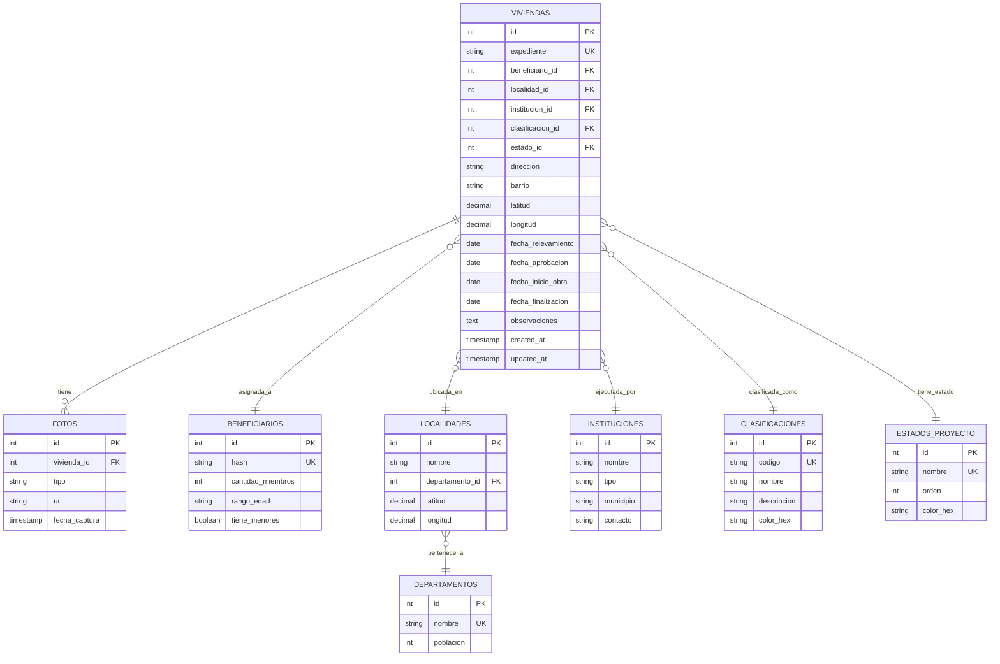

# Prompt para Diseño de Base de Datos - Dashboard de Vivienda Social

## 🎯 Contexto del Proyecto

Estás trabajando en una **PROPUESTA DE CONTINUACIÓN** para una práctica profesionalizante avanzada. El proyecto actual es un **dashboard interactivo de análisis de datos** para la Subsecretaría de Promoción Humana de Santiago del Estero, que actualmente usa datos de muestra en JSON.

### Proyecto Actual (Completado)
- Dashboard con KPIs y visualizaciones
- Mapa interactivo geoespacial
- Galería de impacto antes/después
- Diagrama de flujo del proceso
- **Datos:** 20 registros de muestra en JSON

### Tu Misión (Propuesta Futura)
Diseñar una **base de datos fundamentada** que:
1. Permita alimentar el dashboard con datos reales
2. Facilite el trabajo de analistas y futuros científicos de datos
3. Se base en la entrevista con técnicos de campo
4. Genere JSONs para integración con el dashboard existente
5. Soporte consultas analíticas complejas

---

## 📚 Documentación Base

### 1. Entrevista con Técnico de Campo
**Archivo:** `ENTREVISTA-TECNICO-FLUJO-DATOS.md`

Esta es tu **fuente principal** para entender:
- Qué datos capturan los técnicos en terreno
- Cómo fluyen los datos desde el campo hasta GEDO/VISOC
- Qué información necesitan para su trabajo
- Qué métricas son importantes para la Subsecretaría

**IMPORTANTE:** Lee cuidadosamente las 5 secciones de preguntas:
- Bloque 0: Visión general del proceso
- Bloque 1: Recepción de casos
- Bloque 2: Captura de datos en campo
- Bloque 3: Carga de datos en oficina
- Bloque 4: Transferencia a GEDO
- Bloque 5: Puntos críticos y mejoras

### 2. Datos de Muestra Actuales
- **`proyecto-post-entrevista/data/viviendas.json`** - 20 registros
- **`proyecto-post-entrevista/data/estadisticas.json`** - Agregaciones

Analiza la estructura actual para mantener **compatibilidad** con el dashboard.

### 3. Proceso Documentado
- **`diagrama-flujo-proceso.md`** - 8 fases del proceso actual

### 4. Componentes del Dashboard
Revisa qué datos consumen:
- `proyecto-post-entrevista/components/Dashboard/` - KPIs y gráficos
- `proyecto-post-entrevista/components/Mapa/` - Mapa geoespacial
- `proyecto-post-entrevista/components/Impacto/` - Galería de fotos

---

## 🎯 Objetivos del Diseño de BD

### Objetivo 1: Fundamentación en la Realidad
La BD debe estar **justificada** por:
- Información capturada en campo (según entrevista)
- Necesidades de los técnicos (según entrevista)
- Métricas requeridas por la Subsecretaría
- Problemas identificados que la BD debe resolver

### Objetivo 2: Orientación Analítica
Diseñar para:
- Consultas de analistas de datos
- Generación de reportes estadísticos
- Análisis geoespacial
- Dashboards y visualizaciones
- Exportación a JSON/CSV/Excel

### Objetivo 3: Calidad de Datos
Asegurar:
- Validación de datos en origen
- Trazabilidad (quién cargó qué y cuándo)
- Integridad referencial
- Auditoría de cambios

### Objetivo 4: Compatibilidad con Dashboard Actual
Mantener:
- Estructura de `viviendas.json` para compatibilidad
- Campos necesarios para los componentes existentes
- Formato de coordenadas (lat/lng)
- Clasificaciones actuales (1A, 2A, Derrumbe, Otra)

---

## 📋 Metodología de Diseño

### Paso 1: Análisis de la Entrevista (Fundamental)

Lee `ENTREVISTA-TECNICO-FLUJO-DATOS.md` y extrae:

#### 1.1. Datos Capturados en Campo
Lista TODOS los datos que los técnicos capturan:
- Datos del beneficiario (cantidad de miembros, etc.)
- Ubicación (dirección, barrio, localidad, coordenadas GPS)
- Estado de la vivienda actual (clasificación, materiales, riesgos)
- Fotos (antes, durante, después)
- Servicios disponibles (agua, luz, gas, cloacas)
- Observaciones técnicas

**Pregunta clave:** ¿Qué datos capturan que NO están en `viviendas.json`?

#### 1.2. Flujo de Datos
Mapea el flujo desde campo hasta GEDO:
```
Técnico (campo) → [¿Papel? ¿App?] → VISOC (oficina) → GEDO (oficial)
```

**Preguntas clave:**
- ¿Hay doble carga manual?
- ¿Qué datos se pierden en el camino?
- ¿Qué inconsistencias existen entre VISOC y GEDO?

#### 1.3. Necesidades de los Técnicos
Identifica qué información necesitan:
- Historial de la vivienda
- Estado del expediente
- Avances de obra
- Fotos anteriores
- Datos de otras viviendas cercanas

#### 1.4. Métricas de la Subsecretaría
Identifica qué KPIs necesitan:
- Total de viviendas por estado
- Distribución geográfica
- Tiempo promedio por fase
- Instituciones más activas
- Clasificaciones más frecuentes

### Paso 2: Análisis de los Datos Actuales

#### 2.1. Estructura de `viviendas.json`
Analiza el archivo y documenta:

**Campos actuales:**
```json
{
  "id": int,
  "expediente": string,
  "localidad": string,
  "departamento": string,
  "barrio": string,
  "direccion": string,
  "coordenadas": { "lat": float, "lng": float },
  "clasificacion": string,
  "estado_proyecto": string,
  "fecha_relevamiento": date,
  "fecha_aprobacion": date,
  "fecha_inicio_obra": date,
  "institucion_ejecutora": string,
  "beneficiario_hash": string,
  "cantidad_miembros": int,
  "fotos": { "antes": string, "despues": string },
  "observaciones": string
}
```

**Preguntas:**
- ¿Qué campos son catálogos? (deben ser tablas separadas)
- ¿Qué campos son relaciones? (FK)
- ¿Qué datos faltan para análisis completo?

#### 2.2. Estructura de `estadisticas.json`
Analiza cómo se calculan las agregaciones:
- Total de viviendas
- Distribución por clasificación
- Distribución por estado
- Top departamentos
- Evolución mensual

**Pregunta clave:** ¿La BD puede generar estas estadísticas con queries SQL?

### Paso 3: Diseño de Entidades

#### Entidades Principales (Mínimo requerido)

**ENTIDAD 1: viviendas**
- Campos transaccionales (expediente, dirección, fechas)
- Relaciones: beneficiario, localidad, institución, clasificación, estado

**ENTIDAD 2: beneficiarios**
- Datos anonimizados (hash)
- Datos demográficos no sensibles

**ENTIDAD 3: localidades y departamentos**
- Catálogo geográfico
- Coordenadas de referencia

**ENTIDAD 4: instituciones**
- ONGs, municipios, iglesias
- Datos de contacto

**ENTIDAD 5: clasificaciones**
- 1A, 2A, Derrumbe, Otra
- Descripciones y colores

**ENTIDAD 6: estados_proyecto**
- Relevamiento, Aprobado, En Construcción, Terminado, etc.
- Orden secuencial

**ENTIDAD 7: fotos**
- Relación N:1 con viviendas
- Tipo (antes/durante/después)
- Metadata (fecha, coordenadas, dispositivo)

#### Entidades Opcionales (Según hallazgos de entrevista)

**ENTIDAD 8: relevamientos**
- Múltiples relevamientos por vivienda
- Datos técnicos capturados en campo
- Trazabilidad (quién, cuándo)

**ENTIDAD 9: avances_obra**
- Registro de progreso de construcción
- Porcentaje de avance
- Verificaciones

**ENTIDAD 10: usuarios**
- Técnicos de campo
- Personal administrativo
- Roles y permisos

**ENTIDAD 11: auditorias**
- Log de cambios
- Quién modificó qué

### Paso 4: Diseño de Relaciones

Para cada entidad, define:

1. **Cardinalidad:**
   - 1:1 (ej: vivienda ↔ beneficiario)
   - N:1 (ej: viviendas → localidad)
   - N:N (¿hay alguna?)

2. **Integridad referencial:**
   - ¿Qué pasa si se borra un departamento?
   - ¿Qué pasa si se borra una institución?
   - ¿Se permite borrar o solo marcar como inactivo (soft delete)?

3. **Índices:**
   - ¿Qué campos se buscan frecuentemente?
   - ¿Qué campos se usan en JOINs?
   - ¿Qué campos se usan en ORDER BY?

### Paso 5: Diseño para Análisis

#### Consultas Analíticas Clave

Asegura que la BD permita responder:

1. **KPIs del Dashboard:**
   - Total de viviendas por estado
   - Cantidad de localidades cubiertas
   - Instituciones activas
   - Beneficiarios alcanzados

2. **Distribuciones:**
   - Viviendas por clasificación (gráfico pie)
   - Viviendas por estado (gráfico bar)
   - Viviendas por departamento (gráfico bar)
   - Evolución temporal (gráfico line)

3. **Análisis Geoespacial:**
   - Viviendas dentro de un polígono
   - Viviendas cercanas a un punto
   - Densidad por departamento
   - Clustering de viviendas

4. **Análisis de Eficiencia:**
   - Tiempo promedio por fase
   - Instituciones más rápidas
   - Cuellos de botella en el proceso

5. **Reportes:**
   - Viviendas por institución
   - Histórico de una vivienda
   - Avance de obras en curso
   - Impacto (antes/después)

#### Vistas SQL Recomendadas

Crea vistas para facilitar consultas:

**Vista 1: vista_dashboard_general**
```sql
-- Todos los datos necesarios para el dashboard principal
-- JOIN de viviendas con todas sus relaciones
```

**Vista 2: vista_estadisticas_departamento**
```sql
-- Agregaciones por departamento
```

**Vista 3: vista_evolucion_temporal**
```sql
-- Viviendas agrupadas por mes/año
```

**Vista 4: vista_instituciones_performance**
```sql
-- Métricas por institución ejecutora
```

---

## 📊 Entregables Esperados

### Entregable 1: Documento de Análisis de Entrevista

**Archivo:** `analisis-entrevista-tecnico.md`

**Contenido:**
```markdown
# Análisis de Entrevista - Diseño de Base de Datos

## 1. Datos Capturados en Campo (Según Entrevista)

### 1.1. Datos Obligatorios
[Lista de campos que SIEMPRE capturan]

### 1.2. Datos Opcionales
[Lista de campos que a veces capturan]

### 1.3. Datos Actualmente No Capturados
[Lista de datos que DEBERÍAN capturar pero no lo hacen]

## 2. Flujo de Datos Identificado

### 2.1. Paso 1: Campo → Papel/App
[Descripción del proceso]

### 2.2. Paso 2: Papel → VISOC
[Descripción del proceso - ¿doble carga?]

### 2.3. Paso 3: VISOC → GEDO
[Descripción del proceso - ¿inconsistencias?]

## 3. Puntos Críticos Identificados

### 3.1. Pérdida de Datos
[Qué datos se pierden y dónde]

### 3.2. Duplicación de Esfuerzo
[Qué se carga múltiples veces]

### 3.3. Inconsistencias
[Qué datos no coinciden entre sistemas]

## 4. Necesidades de los Usuarios

### 4.1. Técnicos de Campo
[Qué información necesitan]

### 4.2. Personal Administrativo
[Qué información necesitan]

### 4.3. Gerencia/Subsecretaría
[Qué métricas necesitan]

## 5. Justificación del Diseño de BD

### 5.1. Tablas Propuestas
[Lista de tablas con justificación basada en la entrevista]

### 5.2. Campos Críticos
[Lista de campos clave con justificación]

### 5.3. Mejoras vs Situación Actual
[Qué problemas resuelve la BD propuesta]
```

---

### Entregable 2: Modelo Entidad-Relación

**Archivo:** `modelo-er-dashboard-vivienda.md`

**Contenido:**

#### 2.1. Diagrama ER en Mermaid



#### 2.2. Diccionario de Datos

Tabla completa con:
- Nombre de tabla
- Nombre de campo
- Tipo de dato
- Restricciones
- Descripción
- Justificación (basada en entrevista)

---

### Entregable 3: Scripts SQL

**Archivo:** `esquema-base-datos.sql`

#### 3.1. Creación de Tablas

```sql
-- ===========================================
-- BASE DE DATOS: dashboard_vivienda_social
-- Propósito: Alimentar dashboard analítico
-- Basado en: Entrevista con técnico de campo
-- ===========================================

-- TABLA: departamentos
-- Justificación: División geográfica nivel 1 de Santiago del Estero
CREATE TABLE departamentos (
    id INT AUTO_INCREMENT PRIMARY KEY,
    nombre VARCHAR(100) UNIQUE NOT NULL,
    poblacion INT,
    superficie_km2 DECIMAL(10,2),

    created_at TIMESTAMP DEFAULT CURRENT_TIMESTAMP,
    updated_at TIMESTAMP DEFAULT CURRENT_TIMESTAMP ON UPDATE CURRENT_TIMESTAMP,

    INDEX idx_nombre (nombre)
) ENGINE=InnoDB DEFAULT CHARSET=utf8mb4;

-- TABLA: localidades
-- Justificación: División geográfica nivel 2, necesaria para análisis territorial
CREATE TABLE localidades (
    id INT AUTO_INCREMENT PRIMARY KEY,
    nombre VARCHAR(100) NOT NULL,
    departamento_id INT NOT NULL,
    tipo ENUM('Ciudad', 'Comuna', 'Paraje', 'Otro') DEFAULT 'Comuna',

    -- Coordenadas de referencia del centro de la localidad
    latitud DECIMAL(10, 8),
    longitud DECIMAL(11, 8),

    poblacion INT,
    activo BOOLEAN DEFAULT TRUE,

    created_at TIMESTAMP DEFAULT CURRENT_TIMESTAMP,
    updated_at TIMESTAMP DEFAULT CURRENT_TIMESTAMP ON UPDATE CURRENT_TIMESTAMP,

    FOREIGN KEY (departamento_id) REFERENCES departamentos(id),
    UNIQUE KEY unique_localidad_dpto (nombre, departamento_id),
    INDEX idx_departamento (departamento_id)
) ENGINE=InnoDB DEFAULT CHARSET=utf8mb4;

-- [Continuar con todas las tablas...]
```

#### 3.2. Datos Iniciales (Catálogos)

```sql
-- ===========================================
-- DATOS INICIALES - CATÁLOGOS
-- ===========================================

-- CLASIFICACIONES DE VIVIENDA
-- Justificación: Según entrevista, estas son las 4 clasificaciones usadas
INSERT INTO clasificaciones (codigo, nombre, descripcion, color_hex, orden) VALUES
('1A', 'Vivienda Estándar', 'Vivienda en condiciones aceptables', '#0093d3', 1),
('2A', 'Vivienda Precaria', 'Vivienda con deficiencias estructurales que requiere mejoras', '#fdb813', 2),
('Derrumbe', 'Requiere Demolición', 'Vivienda con riesgo de colapso, debe ser demolida', '#c32026', 3),
('Otra', 'Otra Situación', 'Casos especiales: incapacidad, otras razones', '#737373', 4);

-- ESTADOS DE PROYECTO
-- Justificación: Según diagrama de flujo, estas son las fases del proceso
INSERT INTO estados_proyecto (nombre, orden, color_hex, es_final) VALUES
('Relevamiento', 1, '#9ca3af', FALSE),
('Documentación', 2, '#60a5fa', FALSE),
('Aprobado', 3, '#22c55e', FALSE),
('En Construcción', 4, '#fdb813', FALSE),
('Terminado', 5, '#0093d3', TRUE),
('Rechazado', 6, '#ef4444', TRUE);

-- [Continuar con más datos...]
```

#### 3.3. Vistas para Dashboard

```sql
-- ===========================================
-- VISTAS PARA DASHBOARD
-- ===========================================

-- VISTA: Datos completos de viviendas (para exportar a JSON)
CREATE VIEW vista_viviendas_dashboard AS
SELECT
    v.id,
    v.expediente,

    -- Ubicación
    l.nombre AS localidad,
    d.nombre AS departamento,
    v.barrio,
    v.direccion,
    v.latitud AS lat,
    v.longitud AS lng,

    -- Clasificación y Estado
    c.codigo AS clasificacion,
    c.nombre AS clasificacion_nombre,
    e.nombre AS estado_proyecto,
    e.color_hex AS estado_color,

    -- Institución
    i.nombre AS institucion_ejecutora,
    i.tipo AS tipo_institucion,

    -- Beneficiario (anonimizado)
    b.hash AS beneficiario_hash,
    b.cantidad_miembros,

    -- Fechas
    v.fecha_relevamiento,
    v.fecha_aprobacion,
    v.fecha_inicio_obra,
    v.fecha_finalizacion,

    -- Fotos (contar cantidad)
    (SELECT COUNT(*) FROM fotos WHERE vivienda_id = v.id AND tipo = 'antes') AS tiene_foto_antes,
    (SELECT COUNT(*) FROM fotos WHERE vivienda_id = v.id AND tipo = 'despues') AS tiene_foto_despues,

    -- Observaciones
    v.observaciones

FROM viviendas v
LEFT JOIN localidades l ON v.localidad_id = l.id
LEFT JOIN departamentos d ON l.departamento_id = d.id
LEFT JOIN clasificaciones c ON v.clasificacion_id = c.id
LEFT JOIN estados_proyecto e ON v.estado_id = e.id
LEFT JOIN instituciones i ON v.institucion_id = i.id
LEFT JOIN beneficiarios b ON v.beneficiario_id = b.id
WHERE v.activo = TRUE;

-- [Más vistas...]
```

#### 3.4. Funciones para Análisis

```sql
-- ===========================================
-- FUNCIONES PARA ANALISTAS
-- ===========================================

-- FUNCIÓN: Calcular distancia entre dos puntos (en km)
DELIMITER $$
CREATE FUNCTION calcular_distancia(
    lat1 DECIMAL(10,8),
    lng1 DECIMAL(11,8),
    lat2 DECIMAL(10,8),
    lng2 DECIMAL(11,8)
) RETURNS DECIMAL(10,2)
DETERMINISTIC
BEGIN
    DECLARE distancia DECIMAL(10,2);
    -- Fórmula de Haversine
    SET distancia = 6371 * 2 * ASIN(SQRT(
        POWER(SIN((RADIANS(lat2) - RADIANS(lat1)) / 2), 2) +
        COS(RADIANS(lat1)) * COS(RADIANS(lat2)) *
        POWER(SIN((RADIANS(lng2) - RADIANS(lng1)) / 2), 2)
    ));
    RETURN distancia;
END$$
DELIMITER ;

-- [Más funciones...]
```

#### 3.5. Queries para Exportar JSON

```sql
-- ===========================================
-- QUERIES PARA GENERAR JSON (Compatible con dashboard actual)
-- ===========================================

-- QUERY 1: Generar viviendas.json
SELECT JSON_ARRAYAGG(
    JSON_OBJECT(
        'id', id,
        'expediente', expediente,
        'localidad', localidad,
        'departamento', departamento,
        'barrio', barrio,
        'direccion', direccion,
        'coordenadas', JSON_OBJECT('lat', lat, 'lng', lng),
        'clasificacion', clasificacion,
        'estado_proyecto', estado_proyecto,
        'fecha_relevamiento', DATE_FORMAT(fecha_relevamiento, '%Y-%m-%d'),
        'fecha_aprobacion', DATE_FORMAT(fecha_aprobacion, '%Y-%m-%d'),
        'fecha_inicio_obra', DATE_FORMAT(fecha_inicio_obra, '%Y-%m-%d'),
        'institucion_ejecutora', institucion_ejecutora,
        'beneficiario_hash', beneficiario_hash,
        'cantidad_miembros', cantidad_miembros,
        'observaciones', observaciones
    )
) AS viviendas_json
FROM vista_viviendas_dashboard;

-- QUERY 2: Generar estadisticas.json
SELECT JSON_OBJECT(
    'resumen', JSON_OBJECT(
        'total_viviendas', (SELECT COUNT(*) FROM viviendas WHERE activo = TRUE),
        'total_localidades', (SELECT COUNT(DISTINCT localidad_id) FROM viviendas WHERE activo = TRUE),
        'total_instituciones', (SELECT COUNT(*) FROM instituciones WHERE activo = TRUE)
    ),
    'por_clasificacion', (
        SELECT JSON_ARRAYAGG(
            JSON_OBJECT(
                'clasificacion', c.nombre,
                'cantidad', COUNT(v.id),
                'color', c.color_hex
            )
        )
        FROM clasificaciones c
        LEFT JOIN viviendas v ON v.clasificacion_id = c.id AND v.activo = TRUE
        GROUP BY c.id, c.nombre, c.color_hex
    ),
    'por_estado', (
        SELECT JSON_ARRAYAGG(
            JSON_OBJECT(
                'estado', e.nombre,
                'cantidad', COUNT(v.id),
                'color', e.color_hex
            )
        )
        FROM estados_proyecto e
        LEFT JOIN viviendas v ON v.estado_id = e.id AND v.activo = TRUE
        GROUP BY e.id, e.nombre, e.color_hex
    )
) AS estadisticas_json;

-- [Más queries de exportación...]
```

---

### Entregable 4: Guía de Integración

**Archivo:** `guia-integracion-bd-dashboard.md`

**Contenido:**

```markdown
# Guía de Integración - Base de Datos ↔ Dashboard

## 1. Exportación de Datos a JSON

### Paso 1: Ejecutar Query de Exportación
```bash
mysql -u usuario -p dashboard_vivienda_social < queries/export_viviendas.sql > data/viviendas.json
```

### Paso 2: Validar Estructura
```bash
# Verificar que el JSON es válido
node -e "JSON.parse(require('fs').readFileSync('data/viviendas.json'))"
```

### Paso 3: Reemplazar Datos en Dashboard
```bash
cp data/viviendas.json src/data/viviendas.json
npm run dev
```

## 2. API REST para Dashboard (Futuro)

### Endpoints Propuestos

**GET /api/viviendas**
- Retorna todas las viviendas (filtrable)
- Params: `departamento`, `estado`, `clasificacion`, `limit`, `offset`

**GET /api/estadisticas**
- Retorna estadísticas agregadas
- Params: `fecha_desde`, `fecha_hasta`

**GET /api/viviendas/:id**
- Retorna detalle de una vivienda
- Incluye: fotos, relevamientos, avances

**GET /api/viviendas/cercanas**
- Viviendas cercanas a un punto
- Params: `lat`, `lng`, `radio_km`

### Ejemplo de Implementación (Node.js + Express)

```javascript
// server.js
const express = require('express');
const mysql = require('mysql2/promise');

const app = express();

// Conexión a BD
const pool = mysql.createPool({
  host: 'localhost',
  user: 'dashboard_user',
  password: 'password',
  database: 'dashboard_vivienda_social'
});

// Endpoint: Listar viviendas
app.get('/api/viviendas', async (req, res) => {
  const { departamento, estado, clasificacion, limit = 100 } = req.query;

  let query = 'SELECT * FROM vista_viviendas_dashboard WHERE 1=1';
  const params = [];

  if (departamento) {
    query += ' AND departamento = ?';
    params.push(departamento);
  }

  if (estado) {
    query += ' AND estado_proyecto = ?';
    params.push(estado);
  }

  if (clasificacion) {
    query += ' AND clasificacion = ?';
    params.push(clasificacion);
  }

  query += ' LIMIT ?';
  params.push(parseInt(limit));

  const [rows] = await pool.query(query, params);
  res.json(rows);
});

// [Más endpoints...]

app.listen(3001, () => console.log('API escuchando en puerto 3001'));
```

## 3. Actualización Incremental

### Script de Sincronización Periódica

```bash
#!/bin/bash
# sync-dashboard-data.sh
# Ejecutar cada 1 hora para actualizar datos del dashboard

# Exportar datos desde BD
mysql -u dashboard_user -p dashboard_vivienda_social \
  -e "SELECT * FROM vista_viviendas_dashboard" \
  --batch --silent \
  | jq -Rs 'split("\n") | map(split("\t")) | .[1:] | map({id: .[0], ...})' \
  > /tmp/viviendas_temp.json

# Validar JSON
if jq empty /tmp/viviendas_temp.json 2>/dev/null; then
  # JSON válido, reemplazar
  cp /tmp/viviendas_temp.json /var/www/dashboard/src/data/viviendas.json
  echo "$(date): Datos actualizados exitosamente" >> /var/log/dashboard-sync.log
else
  echo "$(date): ERROR - JSON inválido" >> /var/log/dashboard-sync.log
fi
```

## 4. Queries Útiles para Analistas

### Ejemplos de Análisis

```sql
-- Análisis 1: Tiempo promedio por fase (en días)
SELECT
    e.nombre AS estado,
    AVG(DATEDIFF(v.fecha_actualizacion, v.fecha_relevamiento)) AS dias_promedio
FROM viviendas v
JOIN estados_proyecto e ON v.estado_id = e.id
GROUP BY e.id, e.nombre
ORDER BY e.orden;

-- Análisis 2: Instituciones más eficientes
SELECT
    i.nombre,
    COUNT(v.id) AS total_viviendas,
    SUM(CASE WHEN e.nombre = 'Terminado' THEN 1 ELSE 0 END) AS terminadas,
    AVG(CASE
        WHEN v.fecha_finalizacion IS NOT NULL
        THEN DATEDIFF(v.fecha_finalizacion, v.fecha_inicio_obra)
    END) AS dias_promedio_construccion
FROM instituciones i
JOIN viviendas v ON v.institucion_id = i.id
JOIN estados_proyecto e ON v.estado_id = e.id
GROUP BY i.id, i.nombre
HAVING total_viviendas >= 5
ORDER BY terminadas DESC, dias_promedio_construccion ASC;

-- Análisis 3: Densidad de viviendas por departamento
SELECT
    d.nombre AS departamento,
    COUNT(v.id) AS total_viviendas,
    d.superficie_km2,
    ROUND(COUNT(v.id) / d.superficie_km2, 2) AS densidad_por_km2
FROM departamentos d
LEFT JOIN localidades l ON l.departamento_id = d.id
LEFT JOIN viviendas v ON v.localidad_id = l.id AND v.activo = TRUE
GROUP BY d.id, d.nombre, d.superficie_km2
ORDER BY densidad_por_km2 DESC;
```

---

## 5. Checklist de Validación

Antes de considerar la BD lista:

- [ ] Todos los campos de `viviendas.json` actual están mapeados
- [ ] Los componentes del dashboard pueden consumir los datos exportados
- [ ] Las estadísticas se calculan correctamente
- [ ] Las coordenadas están en el formato correcto (lat/lng decimal)
- [ ] Los colores de clasificaciones y estados coinciden con el frontend
- [ ] Las queries de exportación a JSON son eficientes (< 1 segundo)
- [ ] Existe documentación de cada tabla y campo
- [ ] Hay queries de ejemplo para analistas
- [ ] La BD permite responder todas las preguntas del dashboard actual
- [ ] Se pueden generar nuevos reportes sin modificar la BD
```

---

### Entregable 5: Plan de Implementación

**Archivo:** `plan-implementacion-bd.md`

```markdown
# Plan de Implementación - Base de Datos para Dashboard

## Fase 1: Preparación (Semana 1)

### Actividades:
1. Realizar entrevista con técnico de campo
2. Analizar respuestas y extraer requisitos de datos
3. Documentar flujo de datos actual
4. Validar con stakeholders

### Entregables:
- `analisis-entrevista-tecnico.md`
- Lista de campos requeridos
- Flujo de datos documentado

---

## Fase 2: Diseño (Semana 2)

### Actividades:
1. Diseñar modelo entidad-relación
2. Definir diccionario de datos
3. Crear diagramas ER
4. Validar compatibilidad con dashboard actual

### Entregables:
- `modelo-er-dashboard-vivienda.md`
- Diagrama ER en Mermaid
- Diccionario de datos completo

---

## Fase 3: Implementación (Semana 3-4)

### Actividades:
1. Crear base de datos en MySQL/PostgreSQL
2. Ejecutar scripts de creación de tablas
3. Insertar datos de catálogo
4. Migrar datos de muestra actuales (20 registros)
5. Crear vistas para dashboard

### Entregables:
- BD operativa
- Scripts SQL ejecutados
- Datos de muestra migrados

---

## Fase 4: Integración (Semana 5)

### Actividades:
1. Crear queries de exportación a JSON
2. Generar archivos JSON desde BD
3. Integrar con dashboard existente
4. Validar visualizaciones

### Entregables:
- Scripts de exportación
- `viviendas.json` generado desde BD
- `estadisticas.json` generado desde BD
- Dashboard funcionando con datos de BD

---

## Fase 5: Documentación (Semana 6)

### Actividades:
1. Documentar guía de integración
2. Crear queries de ejemplo para analistas
3. Documentar proceso de actualización de datos
4. Capacitar usuarios

### Entregables:
- `guia-integracion-bd-dashboard.md`
- Colección de queries útiles
- Manual de usuario
- Capacitación completada

---

## Fase 6: Validación y Entrega (Semana 7)

### Actividades:
1. Pruebas de rendimiento
2. Validación de datos con usuarios reales
3. Ajustes finales
4. Presentación final

### Entregables:
- BD validada
- Dashboard integrado
- Documentación completa
- Presentación final
```

---

## 📌 Criterios de Éxito

La BD propuesta será exitosa si:

### 1. Fundamentación Sólida
- ✅ Cada tabla tiene justificación basada en la entrevista
- ✅ Cada campo resuelve una necesidad real de los usuarios
- ✅ El diseño elimina los puntos críticos identificados

### 2. Compatibilidad Total
- ✅ El dashboard actual funciona sin cambios con los JSON exportados
- ✅ Todos los KPIs se calculan correctamente
- ✅ El mapa geoespacial muestra correctamente las coordenadas
- ✅ La galería de impacto carga las fotos correctamente

### 3. Orientación Analítica
- ✅ Los analistas pueden hacer consultas complejas
- ✅ Se pueden generar nuevos reportes sin modificar la BD
- ✅ Las consultas son eficientes (< 2 segundos para 1000+ registros)
- ✅ Se pueden exportar datos a JSON/CSV/Excel fácilmente

### 4. Calidad Profesional
- ✅ Documentación completa y clara
- ✅ Diccionario de datos exhaustivo
- ✅ Scripts SQL bien comentados
- ✅ Queries de ejemplo funcionales

### 5. Viabilidad
- ✅ La BD puede implementarse con herramientas open-source (MySQL/PostgreSQL)
- ✅ No requiere hardware especializado
- ✅ Puede ser mantenida por personal técnico local

---

## 🎓 Notas Finales

Esta base de datos es una **PROPUESTA** para una futura práctica profesionalizante avanzada. No forma parte del proyecto actual (dashboard de análisis) pero representa la **evolución natural** del mismo.

### Relación con el Proyecto Actual

```
PROYECTO ACTUAL (Tu entrega):
└─ Dashboard interactivo
   ├─ Páginas de documentación
   ├─ Visualizaciones (KPIs, gráficos, mapa)
   └─ Datos de muestra (20 registros en JSON)

PROPUESTA FUTURA (Esta BD):
└─ Base de datos real
   ├─ Alimenta el dashboard con datos reales
   ├─ Permite análisis avanzado
   └─ Facilita trabajo de analistas
```

### Valor Académico

Este ejercicio de diseño de BD demuestra:
1. **Capacidad de análisis**: Extraer requisitos de entrevistas
2. **Pensamiento sistémico**: Diseñar solución integral
3. **Orientación a usuarios**: Resolver necesidades reales
4. **Visión de continuidad**: Proponer evolución del proyecto

---

**¡Adelante! Diseña una base de datos sólida, fundamentada y orientada a facilitar el análisis de datos para la Subsecretaría de Promoción Humana.** 📊🗄️
