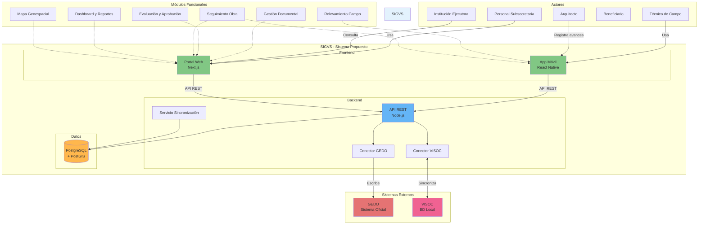
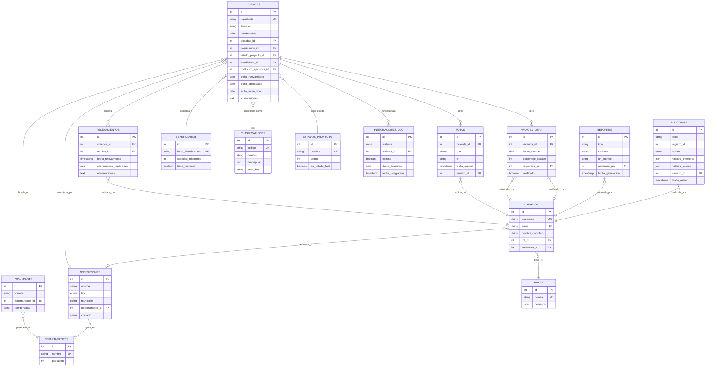

# Prompt para Modelado del Sistema SIGVS - Mapa Conceptual y Modelo Entidad-Relación

## Contexto del Sistema

Estás trabajando en el **SIGVS (Sistema Integral de Gestión de Vivienda Social)**, un sistema propuesto para la Subsecretaría de Promoción Humana de Santiago del Estero, Argentina. El sistema gestiona programas de vivienda social que combaten el mal de Chagas mediante construcción y mejora de viviendas dignas.

---

## Documentación Disponible

Debes leer y analizar los siguientes archivos del proyecto:

### 1. Documentación Principal
- **`diagrama-flujo-proceso.md`** - Diagrama de flujo del proceso actual (8 fases)
- **`propuesta-solucion-software.md`** - Propuesta técnica completa del SIGVS
- **`RESUMEN-SEGUNDA-ENTREVISTA.md`** - Validación del proceso con usuarios
- **`ENTREVISTA-TECNICO-FLUJO-DATOS.md`** - Guía de entrevista sobre flujo de datos

### 2. Datos de Ejemplo
- **`proyecto-post-entrevista/data/viviendas.json`** - 20 registros de ejemplo
- **`proyecto-post-entrevista/data/estadisticas.json`** - Datos agregados

### 3. Contexto del Dominio
- **`entrevista.md`** - Transcripción de entrevista con arquitecto
- **`resumen-entrevista.md`** - Resumen estructurado

---

## Tu Misión

Generar **DOS diagramas técnicos completos** del sistema:

1. **Mapa Conceptual del Sistema** - Vista de alto nivel con actores, procesos y sistemas
2. **Modelo Entidad-Relación (ER)** - Diseño de base de datos con todas las tablas y relaciones

---

## PARTE 1: Mapa Conceptual del Sistema

### Objetivo
Crear un diagrama conceptual que muestre:
- Actores del sistema (personas, roles)
- Procesos principales
- Sistemas externos (GEDO, VISOC)
- Flujo de información
- Módulos del SIGVS propuesto

### Requisitos del Mapa Conceptual

#### A. Identificar Actores

Basándote en `diagrama-flujo-proceso.md`, identifica:

**Actores Principales:**
1. **Institución Ejecutora** (ONG/Municipio/Cáritas)
   - Rol: Presenta casos y ejecuta proyectos
   - Interacciones: Con Técnico y Subsecretaría

2. **Técnico de Campo**
   - Rol: Realiza relevamientos, toma fotos, captura coordenadas
   - Interacciones: Con App Móvil, VISOC

3. **Personal de Subsecretaría**
   - Rol: Verifica, aprueba, registra en GEDO
   - Interacciones: Con GEDO, VISOC, Instituciones

4. **Beneficiario**
   - Rol: Recibe la vivienda
   - Interacciones: Pasivas (proporciona datos)

**Actores Secundarios:**
5. **Arquitecto de Obra**
   - Rol: Supervisa construcción
   - Interacciones: Con sistema de seguimiento

6. **Auditor/Administrador**
   - Rol: Genera reportes, controla procesos
   - Interacciones: Con módulo de reportes

#### B. Identificar Sistemas

**Sistemas Actuales (Legacy):**
1. **GEDO** (Gestión Documental)
   - Tipo: Sistema oficial del gobierno
   - Características: No editable después de registro, oficial
   - Interacción: Solo escritura por Subsecretaría

2. **VISOC** (Base de datos local)
   - Tipo: Base de datos operativa
   - Características: Editable, sin geolocalización
   - Interacción: Lectura/escritura manual

**Sistemas Propuestos (SIGVS):**

3. **App Móvil (React Native)**
   - Usuarios: Técnicos de campo
   - Funciones: Relevamiento, captura de fotos, GPS, offline
   - Datos: Formularios + geolocalización + fotos

4. **Backend API (Node.js)**
   - Función: Lógica de negocio, integración, sincronización
   - Componentes:
     - API REST
     - Servicio de sincronización
     - Conector GEDO (lectura)
     - Conector VISOC (lectura/escritura)
     - Servicio de autenticación

5. **Base de Datos Principal (PostgreSQL + PostGIS)**
   - Función: Almacenamiento central
   - Características: Geoespacial, relacional, transaccional

6. **Portal Web (Next.js)**
   - Usuarios: Personal administrativo, gerencia
   - Funciones:
     - Dashboard con KPIs
     - Mapas interactivos
     - Generación de reportes
     - Administración de usuarios
     - Galería de impacto

#### C. Identificar Procesos/Módulos

Del archivo `diagrama-flujo-proceso.md`, mapea las **8 fases** a módulos del sistema:

**FASE 1: Inicio y Relevamiento**
- Módulo: **Relevamiento de Campo (App Móvil)**
- Actores: Técnico de Campo
- Entradas: Datos del beneficiario, ubicación GPS, fotos
- Salidas: Formulario digital con geolocalización

**FASE 2: Carga y Preparación de Documentación**
- Módulo: **Gestión Documental (Portal Web)**
- Actores: Personal administrativo
- Entradas: Datos del relevamiento, documentos escaneados
- Salidas: Expediente digital preparado

**FASE 3: Verificación Administrativa**
- Módulo: **Verificación y Validación (Portal Web)**
- Actores: Subsecretaría
- Entradas: Expediente digital
- Salidas: Expediente verificado o rechazado

**FASE 4: Registro Oficial (GEDO)**
- Módulo: **Integración GEDO (Backend)**
- Actores: Sistema automático
- Entradas: Expediente verificado
- Salidas: Registro en GEDO con número de expediente

**FASE 5: Evaluación y Aprobación**
- Módulo: **Evaluación y Decisión (Portal Web)**
- Actores: Comisión evaluadora
- Entradas: Expediente + informe técnico
- Salidas: Proyecto aprobado/rechazado

**FASE 6: Ejecución**
- Módulo: **Seguimiento de Obra (App Móvil + Portal)**
- Actores: Institución ejecutora, Arquitecto, Técnico
- Entradas: Avances de obra, fotos
- Salidas: Estados de avance, alertas

**FASE 7: Control y Seguimiento**
- Módulo: **Auditoría y Control (Portal Web)**
- Actores: Subsecretaría, Auditores
- Entradas: Reportes de avance, inspecciones
- Salidas: Alertas, observaciones

**FASE 8: Finalización**
- Módulo: **Cierre y Entrega (Portal Web)**
- Actores: Todos
- Entradas: Acta de recepción, fotos finales
- Salidas: Proyecto cerrado, impacto documentado

#### D. Flujos de Información

Mapea los flujos de datos entre sistemas:

```
FLUJO 1: Relevamiento de Campo
Técnico → App Móvil → [Offline Storage] → [Sync] → Backend API → PostgreSQL

FLUJO 2: Visualización de Datos
PostgreSQL → Backend API → Portal Web → Usuario administrativo

FLUJO 3: Integración GEDO (Escritura)
PostgreSQL → Backend API → Conector GEDO → GEDO

FLUJO 4: Integración VISOC (Lectura/Escritura)
VISOC ↔ Conector VISOC ↔ Backend API ↔ PostgreSQL

FLUJO 5: Generación de Reportes
Usuario → Portal Web → Backend API → PostgreSQL → PDF/Excel
```

### Formato del Mapa Conceptual

Genera el mapa conceptual en **DOS formatos**:

#### Formato 1: Mermaid (Código)



#### Formato 2: Descripción Textual Estructurada

Además del diagrama, escribe una descripción narrativa:

```markdown
# Arquitectura del SIGVS

## Capas del Sistema

### 1. Capa de Presentación (Frontend)
- **App Móvil** (React Native): Para técnicos de campo...
- **Portal Web** (Next.js): Para personal administrativo...

### 2. Capa de Lógica de Negocio (Backend)
- **API REST** (Node.js + Express): Maneja todas las operaciones...
- **Servicios de Integración**: Conectores con GEDO y VISOC...

### 3. Capa de Datos
- **Base de datos principal** (PostgreSQL + PostGIS): Almacena...
- **Cache** (Redis): Para mejorar rendimiento...

### 4. Sistemas Externos
- **GEDO**: Sistema oficial gubernamental...
- **VISOC**: Base de datos operativa actual...

## Flujos de Trabajo Principales

### Flujo 1: Relevamiento en Terreno
1. Técnico abre app móvil en modo offline
2. Completa formulario con datos del beneficiario
3. Captura ubicación GPS automática
4. Toma fotos de la vivienda actual
5. Datos se guardan localmente
6. Al tener conexión, sincroniza con backend
7. Backend almacena en PostgreSQL

### Flujo 2: Aprobación de Proyecto
[...]
```

---

## PARTE 2: Modelo Entidad-Relación (ER)

### Objetivo
Diseñar la base de datos completa con:
- Todas las tablas necesarias
- Relaciones entre entidades
- Cardinalidades
- Tipos de datos
- Constraints e índices
- Queries de creación en MySQL/PostgreSQL

### Análisis Previo

Antes de diseñar, analiza:

1. **Datos de ejemplo** en `viviendas.json`:
   - Qué campos existen
   - Qué podría ser una tabla separada
   - Qué son relaciones N:1 vs N:N

2. **Propuesta de software** en `propuesta-solucion-software.md`:
   - Entidades mencionadas
   - Relaciones descritas

3. **Proceso documentado** en `diagrama-flujo-proceso.md`:
   - Qué datos se generan en cada fase
   - Quién los genera

### Entidades Principales

#### 1. VIVIENDAS (Housing)

**Tabla:** `viviendas`

```sql
CREATE TABLE viviendas (
    id SERIAL PRIMARY KEY,
    expediente VARCHAR(50) UNIQUE NOT NULL,

    -- Ubicación
    direccion VARCHAR(255),
    barrio VARCHAR(100),
    localidad_id INT REFERENCES localidades(id),
    departamento_id INT REFERENCES departamentos(id),
    coordenadas GEOMETRY(Point, 4326), -- PostGIS

    -- Clasificación y Estado
    clasificacion_id INT REFERENCES clasificaciones(id),
    estado_proyecto_id INT REFERENCES estados_proyecto(id),

    -- Beneficiario
    beneficiario_id INT REFERENCES beneficiarios(id),

    -- Institución Ejecutora
    institucion_ejecutora_id INT REFERENCES instituciones(id),

    -- Fechas
    fecha_relevamiento DATE,
    fecha_aprobacion DATE,
    fecha_inicio_obra DATE,
    fecha_finalizacion_obra DATE,
    fecha_creacion TIMESTAMP DEFAULT CURRENT_TIMESTAMP,
    fecha_actualizacion TIMESTAMP DEFAULT CURRENT_TIMESTAMP,

    -- Metadatos
    observaciones TEXT,
    activo BOOLEAN DEFAULT TRUE,

    -- Índices para optimización
    INDEX idx_expediente (expediente),
    INDEX idx_localidad (localidad_id),
    INDEX idx_estado (estado_proyecto_id),
    INDEX idx_institucion (institucion_ejecutora_id),
    SPATIAL INDEX idx_coordenadas (coordenadas)
);
```

**Relaciones:**
- N:1 con `localidades`
- N:1 con `departamentos`
- N:1 con `clasificaciones`
- N:1 con `estados_proyecto`
- 1:1 con `beneficiarios`
- N:1 con `instituciones`
- 1:N con `fotos`
- 1:N con `relevamientos`
- 1:N con `avances_obra`

#### 2. BENEFICIARIOS (Beneficiaries)

**Tabla:** `beneficiarios`

```sql
CREATE TABLE beneficiarios (
    id SERIAL PRIMARY KEY,
    hash_identificacion VARCHAR(64) UNIQUE NOT NULL, -- Hash para anonimizar
    cantidad_miembros INT,

    -- Datos demográficos (opcionales, anonimizados)
    rango_edad VARCHAR(20), -- ej: "30-40"
    tiene_menores BOOLEAN,

    -- Metadatos
    fecha_creacion TIMESTAMP DEFAULT CURRENT_TIMESTAMP,
    fecha_actualizacion TIMESTAMP DEFAULT CURRENT_TIMESTAMP,

    INDEX idx_hash (hash_identificacion)
);
```

**Nota:** Datos sensibles (nombre, DNI, etc.) NO se almacenan por privacidad.

#### 3. INSTITUCIONES (Executing Institutions)

**Tabla:** `instituciones`

```sql
CREATE TABLE instituciones (
    id SERIAL PRIMARY KEY,
    nombre VARCHAR(255) NOT NULL,
    tipo ENUM('ONG', 'Municipio', 'Iglesia', 'Otro') NOT NULL,

    -- Ubicación
    municipio VARCHAR(100),
    departamento_id INT REFERENCES departamentos(id),

    -- Contacto
    telefono VARCHAR(50),
    email VARCHAR(100),
    responsable VARCHAR(255),

    -- Estado
    activo BOOLEAN DEFAULT TRUE,

    -- Fechas
    fecha_alta DATE,
    fecha_creacion TIMESTAMP DEFAULT CURRENT_TIMESTAMP,
    fecha_actualizacion TIMESTAMP DEFAULT CURRENT_TIMESTAMP,

    INDEX idx_tipo (tipo),
    INDEX idx_departamento (departamento_id)
);
```

#### 4. CLASIFICACIONES (Housing Types)

**Tabla:** `clasificaciones`

```sql
CREATE TABLE clasificaciones (
    id SERIAL PRIMARY KEY,
    codigo VARCHAR(10) UNIQUE NOT NULL, -- '1A', '2A', 'Derrumbe', etc.
    nombre VARCHAR(100) NOT NULL,
    descripcion TEXT,
    color_hex VARCHAR(7), -- Para visualización en UI
    orden INT,
    activo BOOLEAN DEFAULT TRUE
);

-- Datos iniciales
INSERT INTO clasificaciones (codigo, nombre, descripcion, color_hex, orden) VALUES
('1A', 'Vivienda Estándar', 'Vivienda en condiciones aceptables', '#0093d3', 1),
('2A', 'Vivienda Precaria', 'Vivienda con deficiencias estructurales', '#fdb813', 2),
('Derrumbe', 'Requiere Demolición', 'Vivienda con riesgo de colapso', '#c32026', 3),
('Otra', 'Otra Situación', 'Incapacidad u otra razón', '#737373', 4);
```

#### 5. ESTADOS_PROYECTO (Project States)

**Tabla:** `estados_proyecto`

```sql
CREATE TABLE estados_proyecto (
    id SERIAL PRIMARY KEY,
    nombre VARCHAR(50) UNIQUE NOT NULL,
    descripcion TEXT,
    color_hex VARCHAR(7),
    orden INT NOT NULL,
    es_estado_final BOOLEAN DEFAULT FALSE,
    activo BOOLEAN DEFAULT TRUE
);

-- Datos iniciales
INSERT INTO estados_proyecto (nombre, descripcion, color_hex, orden, es_estado_final) VALUES
('Relevamiento', 'En proceso de relevamiento inicial', '#737373', 1, FALSE),
('Documentación', 'Preparando documentación', '#9ca3af', 2, FALSE),
('Verificación', 'En verificación administrativa', '#60a5fa', 3, FALSE),
('Aprobado', 'Proyecto aprobado para ejecución', '#22c55e', 4, FALSE),
('En Construcción', 'Obra en proceso de construcción', '#fdb813', 5, FALSE),
('Inspección Final', 'En proceso de inspección final', '#a78bfa', 6, FALSE),
('Terminado', 'Proyecto completado', '#0093d3', 7, TRUE),
('Rechazado', 'Proyecto rechazado', '#ef4444', 8, TRUE);
```

#### 6. LOCALIDADES Y DEPARTAMENTOS (Geographic Divisions)

**Tabla:** `departamentos`

```sql
CREATE TABLE departamentos (
    id SERIAL PRIMARY KEY,
    nombre VARCHAR(100) UNIQUE NOT NULL,
    codigo VARCHAR(10),
    superficie_km2 DECIMAL(10, 2),
    poblacion INT,
    activo BOOLEAN DEFAULT TRUE,

    INDEX idx_nombre (nombre)
);
```

**Tabla:** `localidades`

```sql
CREATE TABLE localidades (
    id SERIAL PRIMARY KEY,
    nombre VARCHAR(100) NOT NULL,
    departamento_id INT REFERENCES departamentos(id),
    tipo ENUM('Ciudad', 'Comuna', 'Paraje', 'Otro') DEFAULT 'Comuna',
    poblacion INT,
    coordenadas GEOMETRY(Point, 4326),
    activo BOOLEAN DEFAULT TRUE,

    UNIQUE KEY unique_localidad_departamento (nombre, departamento_id),
    INDEX idx_departamento (departamento_id),
    SPATIAL INDEX idx_coordenadas (coordenadas)
);
```

#### 7. FOTOS (Photos)

**Tabla:** `fotos`

```sql
CREATE TABLE fotos (
    id SERIAL PRIMARY KEY,
    vivienda_id INT REFERENCES viviendas(id) ON DELETE CASCADE,
    tipo ENUM('antes', 'durante', 'despues') NOT NULL,

    -- Almacenamiento
    url VARCHAR(500) NOT NULL,
    nombre_archivo VARCHAR(255),
    tamaño_bytes INT,
    mime_type VARCHAR(50),

    -- Metadatos
    fecha_captura TIMESTAMP,
    coordenadas_captura GEOMETRY(Point, 4326),
    dispositivo VARCHAR(100),

    -- Fecha de registro
    fecha_subida TIMESTAMP DEFAULT CURRENT_TIMESTAMP,

    -- Usuario que subió
    usuario_id INT REFERENCES usuarios(id),

    INDEX idx_vivienda (vivienda_id),
    INDEX idx_tipo (tipo),
    INDEX idx_fecha (fecha_captura)
);
```

#### 8. RELEVAMIENTOS (Field Surveys)

**Tabla:** `relevamientos`

```sql
CREATE TABLE relevamientos (
    id SERIAL PRIMARY KEY,
    vivienda_id INT REFERENCES viviendas(id),
    tecnico_id INT REFERENCES usuarios(id),

    -- Datos del relevamiento
    fecha_relevamiento TIMESTAMP NOT NULL,
    coordenadas_capturadas GEOMETRY(Point, 4326),

    -- Datos técnicos
    tipo_construccion VARCHAR(100),
    materiales_predominantes TEXT,
    estado_general ENUM('Bueno', 'Regular', 'Malo', 'Crítico'),
    servicios_disponibles JSON, -- {agua, luz, gas, cloacas}

    -- Observaciones
    observaciones TEXT,
    riesgos_identificados TEXT,

    -- Metadatos del dispositivo
    dispositivo VARCHAR(100),
    version_app VARCHAR(20),
    sincronizado BOOLEAN DEFAULT FALSE,
    fecha_sincronizacion TIMESTAMP,

    fecha_creacion TIMESTAMP DEFAULT CURRENT_TIMESTAMP,

    INDEX idx_vivienda (vivienda_id),
    INDEX idx_tecnico (tecnico_id),
    INDEX idx_fecha (fecha_relevamiento),
    INDEX idx_sincronizado (sincronizado)
);
```

#### 9. USUARIOS (Users - Técnicos, Administrativos)

**Tabla:** `usuarios`

```sql
CREATE TABLE usuarios (
    id SERIAL PRIMARY KEY,
    username VARCHAR(50) UNIQUE NOT NULL,
    email VARCHAR(100) UNIQUE NOT NULL,
    password_hash VARCHAR(255) NOT NULL,

    -- Datos personales
    nombre_completo VARCHAR(255) NOT NULL,
    dni VARCHAR(20),
    telefono VARCHAR(50),

    -- Rol y permisos
    rol_id INT REFERENCES roles(id),
    institucion_id INT REFERENCES instituciones(id), -- Solo para técnicos

    -- Estado
    activo BOOLEAN DEFAULT TRUE,
    email_verificado BOOLEAN DEFAULT FALSE,

    -- Fechas
    fecha_creacion TIMESTAMP DEFAULT CURRENT_TIMESTAMP,
    fecha_ultimo_acceso TIMESTAMP,

    INDEX idx_username (username),
    INDEX idx_email (email),
    INDEX idx_rol (rol_id),
    INDEX idx_institucion (institucion_id)
);
```

**Tabla:** `roles`

```sql
CREATE TABLE roles (
    id SERIAL PRIMARY KEY,
    nombre VARCHAR(50) UNIQUE NOT NULL, -- 'Admin', 'Tecnico', 'Auditor', etc.
    descripcion TEXT,
    permisos JSON, -- Lista de permisos
    activo BOOLEAN DEFAULT TRUE
);

-- Datos iniciales
INSERT INTO roles (nombre, descripcion, permisos) VALUES
('Admin', 'Administrador del sistema', '["*"]'),
('Coordinador', 'Coordinador de subsecretaría', '["aprobar", "rechazar", "ver_reportes"]'),
('Tecnico', 'Técnico de campo', '["crear_relevamiento", "subir_fotos", "editar_relevamiento"]'),
('Auditor', 'Auditor de proyectos', '["ver_todo", "generar_reportes"]'),
('Consulta', 'Acceso de solo lectura', '["ver"]');
```

#### 10. AVANCES_OBRA (Construction Progress)

**Tabla:** `avances_obra`

```sql
CREATE TABLE avances_obra (
    id SERIAL PRIMARY KEY,
    vivienda_id INT REFERENCES viviendas(id),

    -- Datos del avance
    fecha_avance DATE NOT NULL,
    porcentaje_avance INT CHECK (porcentaje_avance BETWEEN 0 AND 100),

    -- Descripción
    descripcion TEXT,
    observaciones TEXT,

    -- Registro
    registrado_por INT REFERENCES usuarios(id),
    fecha_registro TIMESTAMP DEFAULT CURRENT_TIMESTAMP,

    -- Verificación
    verificado BOOLEAN DEFAULT FALSE,
    verificado_por INT REFERENCES usuarios(id),
    fecha_verificacion TIMESTAMP,

    INDEX idx_vivienda (vivienda_id),
    INDEX idx_fecha (fecha_avance),
    INDEX idx_registrado_por (registrado_por)
);
```

#### 11. AUDITORIAS (Audit Log)

**Tabla:** `auditorias`

```sql
CREATE TABLE auditorias (
    id SERIAL PRIMARY KEY,

    -- Qué se modificó
    tabla VARCHAR(50) NOT NULL,
    registro_id INT NOT NULL,
    accion ENUM('INSERT', 'UPDATE', 'DELETE') NOT NULL,

    -- Datos antes y después
    valores_anteriores JSON,
    valores_nuevos JSON,

    -- Quién y cuándo
    usuario_id INT REFERENCES usuarios(id),
    fecha_accion TIMESTAMP DEFAULT CURRENT_TIMESTAMP,

    -- Contexto
    ip_address VARCHAR(45),
    user_agent TEXT,

    INDEX idx_tabla_registro (tabla, registro_id),
    INDEX idx_usuario (usuario_id),
    INDEX idx_fecha (fecha_accion)
);
```

#### 12. REPORTES (Generated Reports)

**Tabla:** `reportes`

```sql
CREATE TABLE reportes (
    id SERIAL PRIMARY KEY,

    -- Tipo de reporte
    tipo VARCHAR(50) NOT NULL, -- 'dashboard', 'geografico', 'institucional', etc.
    titulo VARCHAR(255) NOT NULL,
    descripcion TEXT,

    -- Filtros aplicados
    filtros JSON,

    -- Archivo generado
    formato ENUM('PDF', 'Excel', 'CSV') NOT NULL,
    url_archivo VARCHAR(500),
    tamaño_bytes INT,

    -- Generación
    generado_por INT REFERENCES usuarios(id),
    fecha_generacion TIMESTAMP DEFAULT CURRENT_TIMESTAMP,

    -- Expiración (opcional)
    fecha_expiracion TIMESTAMP,

    INDEX idx_tipo (tipo),
    INDEX idx_generado_por (generado_por),
    INDEX idx_fecha (fecha_generacion)
);
```

#### 13. INTEGRACIONES (GEDO/VISOC Sync Logs)

**Tabla:** `integraciones_log`

```sql
CREATE TABLE integraciones_log (
    id SERIAL PRIMARY KEY,

    -- Sistema externo
    sistema ENUM('GEDO', 'VISOC') NOT NULL,
    operacion ENUM('READ', 'WRITE', 'SYNC') NOT NULL,

    -- Datos sincronizados
    vivienda_id INT REFERENCES viviendas(id),

    -- Resultado
    exitoso BOOLEAN NOT NULL,
    mensaje_respuesta TEXT,
    codigo_error VARCHAR(50),

    -- Datos enviados/recibidos
    datos_enviados JSON,
    datos_recibidos JSON,

    -- Timestamp
    fecha_integracion TIMESTAMP DEFAULT CURRENT_TIMESTAMP,
    duracion_ms INT,

    INDEX idx_sistema (sistema),
    INDEX idx_vivienda (vivienda_id),
    INDEX idx_exitoso (exitoso),
    INDEX idx_fecha (fecha_integracion)
);
```

---

### Diagrama Entidad-Relación

#### Formato 1: Mermaid ER Diagram



#### Formato 2: Script SQL Completo

Genera un archivo SQL que contenga:

1. **Creación de todas las tablas** (en orden correcto respetando dependencias)
2. **Constraints**: Foreign keys, checks, unique
3. **Índices**: Para optimización de queries
4. **Datos iniciales**: Para tablas de catálogo (clasificaciones, estados, roles)

```sql
-- ===========================================
-- SIGVS - Sistema Integral de Gestión de Vivienda Social
-- Base de Datos PostgreSQL + PostGIS
-- ===========================================

-- Activar extensión PostGIS para datos geoespaciales
CREATE EXTENSION IF NOT EXISTS postgis;

-- ===========================================
-- TABLAS DE CATÁLOGO (Sin dependencias)
-- ===========================================

-- [Incluir aquí todas las tablas con sus CREATE TABLE]

-- ===========================================
-- DATOS INICIALES
-- ===========================================

-- [Incluir aquí todos los INSERT iniciales]

-- ===========================================
-- VISTAS ÚTILES
-- ===========================================

-- Vista: Resumen de viviendas con datos relacionados
CREATE VIEW vista_viviendas_completo AS
SELECT
    v.id,
    v.expediente,
    v.direccion,
    l.nombre AS localidad,
    d.nombre AS departamento,
    ST_AsText(v.coordenadas) AS coordenadas_wkt,
    c.nombre AS clasificacion,
    e.nombre AS estado_proyecto,
    i.nombre AS institucion_ejecutora,
    b.cantidad_miembros,
    v.fecha_relevamiento,
    v.fecha_aprobacion,
    v.fecha_inicio_obra,
    v.fecha_finalizacion_obra,
    (SELECT COUNT(*) FROM fotos WHERE vivienda_id = v.id) AS cantidad_fotos,
    (SELECT MAX(porcentaje_avance) FROM avances_obra WHERE vivienda_id = v.id) AS porcentaje_avance
FROM viviendas v
LEFT JOIN localidades l ON v.localidad_id = l.id
LEFT JOIN departamentos d ON v.departamento_id = d.id
LEFT JOIN clasificaciones c ON v.clasificacion_id = c.id
LEFT JOIN estados_proyecto e ON v.estado_proyecto_id = e.id
LEFT JOIN instituciones i ON v.institucion_ejecutora_id = i.id
LEFT JOIN beneficiarios b ON v.beneficiario_id = b.id
WHERE v.activo = TRUE;

-- Vista: Estadísticas por departamento
CREATE VIEW vista_estadisticas_departamento AS
SELECT
    d.nombre AS departamento,
    COUNT(DISTINCT v.id) AS total_viviendas,
    COUNT(DISTINCT CASE WHEN e.nombre = 'Terminado' THEN v.id END) AS terminadas,
    COUNT(DISTINCT CASE WHEN e.nombre = 'En Construcción' THEN v.id END) AS en_construccion,
    COUNT(DISTINCT CASE WHEN e.nombre = 'Aprobado' THEN v.id END) AS aprobadas,
    COUNT(DISTINCT l.id) AS localidades_cubiertas,
    COUNT(DISTINCT i.id) AS instituciones_activas
FROM departamentos d
LEFT JOIN viviendas v ON v.departamento_id = d.id AND v.activo = TRUE
LEFT JOIN estados_proyecto e ON v.estado_proyecto_id = e.id
LEFT JOIN localidades l ON v.localidad_id = l.id
LEFT JOIN instituciones i ON v.institucion_ejecutora_id = i.id
GROUP BY d.id, d.nombre
ORDER BY total_viviendas DESC;

-- ===========================================
-- FUNCIONES ÚTILES
-- ===========================================

-- Función: Calcular distancia entre vivienda y localidad
CREATE OR REPLACE FUNCTION calcular_distancia_localidad(vivienda_id INT)
RETURNS DECIMAL AS $$
DECLARE
    distancia DECIMAL;
BEGIN
    SELECT ST_Distance(
        v.coordenadas::geography,
        l.coordenadas::geography
    ) / 1000 INTO distancia -- Resultado en kilómetros
    FROM viviendas v
    JOIN localidades l ON v.localidad_id = l.id
    WHERE v.id = vivienda_id;

    RETURN distancia;
END;
$$ LANGUAGE plpgsql;

-- Función: Obtener viviendas cercanas
CREATE OR REPLACE FUNCTION viviendas_cercanas(lat DECIMAL, lng DECIMAL, radio_km INT DEFAULT 10)
RETURNS TABLE (
    id INT,
    expediente VARCHAR,
    direccion VARCHAR,
    distancia_km DECIMAL
) AS $$
BEGIN
    RETURN QUERY
    SELECT
        v.id,
        v.expediente,
        v.direccion,
        ROUND(
            ST_Distance(
                v.coordenadas::geography,
                ST_SetSRID(ST_MakePoint(lng, lat), 4326)::geography
            ) / 1000,
            2
        ) AS distancia_km
    FROM viviendas v
    WHERE v.activo = TRUE
        AND ST_DWithin(
            v.coordenadas::geography,
            ST_SetSRID(ST_MakePoint(lng, lat), 4326)::geography,
            radio_km * 1000
        )
    ORDER BY distancia_km;
END;
$$ LANGUAGE plpgsql;

-- ===========================================
-- TRIGGERS PARA AUDITORÍA
-- ===========================================

-- Trigger: Registrar cambios en viviendas
CREATE OR REPLACE FUNCTION trigger_auditoria_viviendas()
RETURNS TRIGGER AS $$
BEGIN
    IF TG_OP = 'UPDATE' THEN
        INSERT INTO auditorias (tabla, registro_id, accion, valores_anteriores, valores_nuevos)
        VALUES ('viviendas', NEW.id, 'UPDATE', row_to_json(OLD), row_to_json(NEW));
    ELSIF TG_OP = 'INSERT' THEN
        INSERT INTO auditorias (tabla, registro_id, accion, valores_nuevos)
        VALUES ('viviendas', NEW.id, 'INSERT', row_to_json(NEW));
    ELSIF TG_OP = 'DELETE' THEN
        INSERT INTO auditorias (tabla, registro_id, accion, valores_anteriores)
        VALUES ('viviendas', OLD.id, 'DELETE', row_to_json(OLD));
    END IF;
    RETURN NEW;
END;
$$ LANGUAGE plpgsql;

CREATE TRIGGER auditoria_viviendas
AFTER INSERT OR UPDATE OR DELETE ON viviendas
FOR EACH ROW EXECUTE FUNCTION trigger_auditoria_viviendas();

-- ===========================================
-- ÍNDICES ADICIONALES PARA OPTIMIZACIÓN
-- ===========================================

-- Índices para búsquedas frecuentes
CREATE INDEX idx_viviendas_estado_fecha ON viviendas(estado_proyecto_id, fecha_creacion);
CREATE INDEX idx_fotos_vivienda_tipo ON fotos(vivienda_id, tipo);
CREATE INDEX idx_relevamientos_fecha ON relevamientos(fecha_relevamiento DESC);

-- Índices geoespaciales
CREATE INDEX idx_viviendas_coordenadas_gist ON viviendas USING GIST(coordenadas);
CREATE INDEX idx_localidades_coordenadas_gist ON localidades USING GIST(coordenadas);

-- ===========================================
-- QUERIES DE EJEMPLO
-- ===========================================

-- 1. Obtener todas las viviendas en construcción con sus datos completos
SELECT * FROM vista_viviendas_completo
WHERE estado_proyecto = 'En Construcción'
ORDER BY fecha_inicio_obra DESC;

-- 2. Top 10 instituciones por cantidad de proyectos terminados
SELECT
    i.nombre,
    COUNT(*) as proyectos_terminados,
    AVG(EXTRACT(EPOCH FROM (v.fecha_finalizacion_obra - v.fecha_inicio_obra)) / 86400) as dias_promedio_obra
FROM viviendas v
JOIN instituciones i ON v.institucion_ejecutora_id = i.id
JOIN estados_proyecto e ON v.estado_proyecto_id = e.id
WHERE e.nombre = 'Terminado'
GROUP BY i.id, i.nombre
ORDER BY proyectos_terminados DESC
LIMIT 10;

-- 3. Viviendas dentro de un polígono (zona geográfica)
SELECT * FROM viviendas
WHERE ST_Within(
    coordenadas,
    ST_GeomFromText('POLYGON((-64.3 -27.8, -64.2 -27.8, -64.2 -27.7, -64.3 -27.7, -64.3 -27.8))', 4326)
);

-- 4. Estadísticas de sincronización con GEDO
SELECT
    DATE(fecha_integracion) as fecha,
    COUNT(*) as total_intentos,
    SUM(CASE WHEN exitoso THEN 1 ELSE 0 END) as exitosos,
    AVG(duracion_ms) as duracion_promedio_ms
FROM integraciones_log
WHERE sistema = 'GEDO'
GROUP BY DATE(fecha_integracion)
ORDER BY fecha DESC
LIMIT 30;

-- ===========================================
-- FIN DEL SCRIPT
-- ===========================================
```

---

### Formato 3: Diagrama Visual (Draw.io/Lucidchart XML)

También genera un archivo `.drawio` o instrucciones para crear el diagrama en herramientas visuales:

```xml
<!-- Instrucciones para Draw.io -->
<!--
1. Abrir https://app.diagrams.net/
2. Crear nuevo diagrama
3. Seleccionar plantilla "Entity Relation"
4. Agregar entidades según el diseño
5. Conectar con relaciones según cardinalidades
-->
```

---

## Cardinalidades y Relaciones Clave

Documenta explícitamente:

| Relación | Cardinalidad | Descripción |
|----------|--------------|-------------|
| VIVIENDAS ↔ BENEFICIARIOS | 1:1 | Cada vivienda tiene un único beneficiario |
| VIVIENDAS ↔ INSTITUCIONES | N:1 | Varias viviendas pueden ser ejecutadas por una institución |
| VIVIENDAS ↔ FOTOS | 1:N | Una vivienda puede tener múltiples fotos |
| VIVIENDAS ↔ RELEVAMIENTOS | 1:N | Una vivienda puede tener múltiples relevamientos |
| VIVIENDAS ↔ LOCALIDADES | N:1 | Varias viviendas en una localidad |
| LOCALIDADES ↔ DEPARTAMENTOS | N:1 | Varias localidades en un departamento |
| USUARIOS ↔ ROLES | N:1 | Varios usuarios con un mismo rol |
| USUARIOS ↔ INSTITUCIONES | N:1 (opcional) | Técnicos pertenecen a una institución |
| RELEVAMIENTOS ↔ USUARIOS | N:1 | Varios relevamientos por un técnico |
| VIVIENDAS ↔ ESTADOS_PROYECTO | N:1 | Varias viviendas en un mismo estado |
| VIVIENDAS ↔ CLASIFICACIONES | N:1 | Varias viviendas de una misma clasificación |

---

## Entregables Esperados

Al finalizar, deberías generar:

1. ✅ **Mapa Conceptual del Sistema** (archivo Mermaid + PNG exportado)
2. ✅ **Diagrama ER completo** (archivo Mermaid + PNG exportado)
3. ✅ **Script SQL completo** (archivo .sql con todo el esquema)
4. ✅ **Documentación de entidades** (archivo .md con descripción de cada tabla)
5. ✅ **Diccionario de datos** (archivo Excel/CSV con todas las columnas)
6. ✅ **Queries de ejemplo** (archivo .sql con 20+ queries útiles)

---

## Herramientas Recomendadas

- **Mermaid Live Editor:** https://mermaid.live/
- **dbdiagram.io:** https://dbdiagram.io/home (sintaxis específica para ER diagrams)
- **Draw.io:** https://app.diagrams.net/
- **PostgreSQL + PostGIS:** Para testing del esquema
- **DBeaver:** Para visualización y exploración

---

## Validación Final

Verifica que el modelo:

- [ ] Cubre todas las entidades mencionadas en `propuesta-solucion-software.md`
- [ ] Representa todas las fases del `diagrama-flujo-proceso.md`
- [ ] Es consistente con los datos de ejemplo en `viviendas.json`
- [ ] Incluye auditoría para trazabilidad
- [ ] Tiene índices para optimizar queries geoespaciales
- [ ] Usa PostGIS para almacenar coordenadas
- [ ] Respeta privacidad (beneficiarios anonimizados)
- [ ] Permite sincronización con GEDO/VISOC
- [ ] Soporta trabajo offline (tabla relevamientos con flag sincronizado)
- [ ] Incluye metadatos (fechas de creación, actualización, soft deletes con campo activo)

---

**¡Adelante! Diseña un sistema de datos robusto, escalable y bien documentado para el SIGVS.** 📊🗺️
